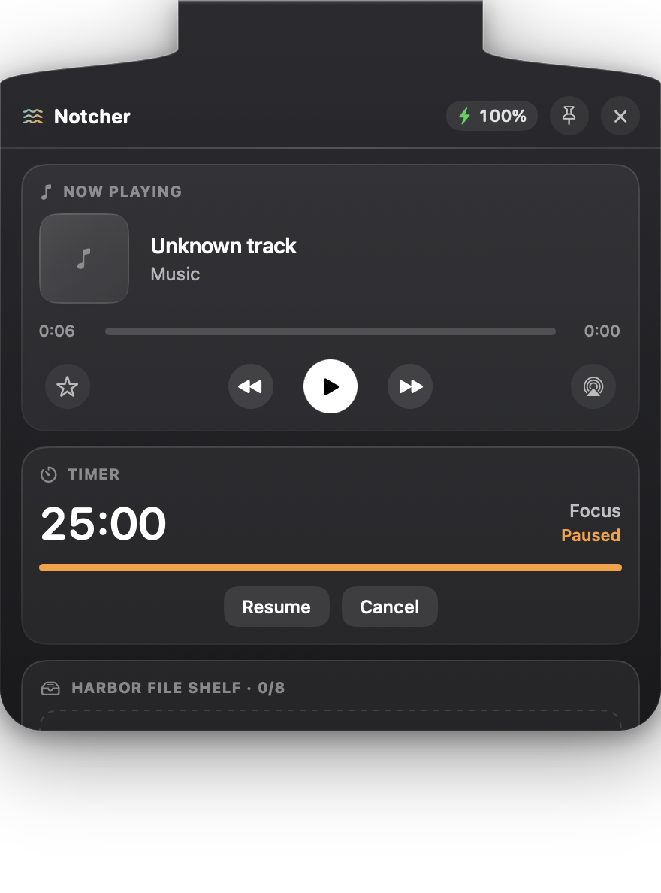
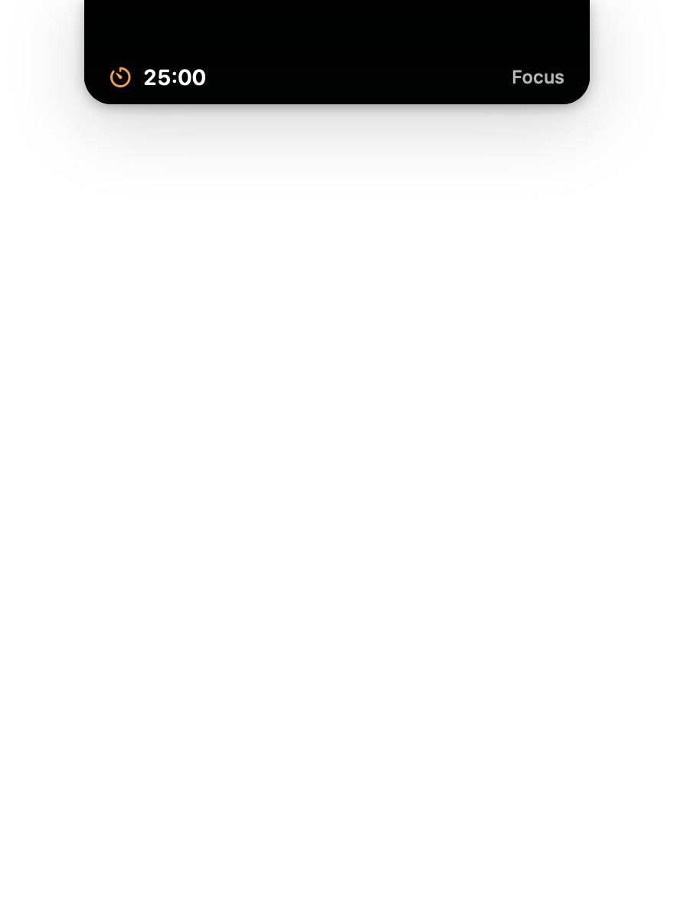
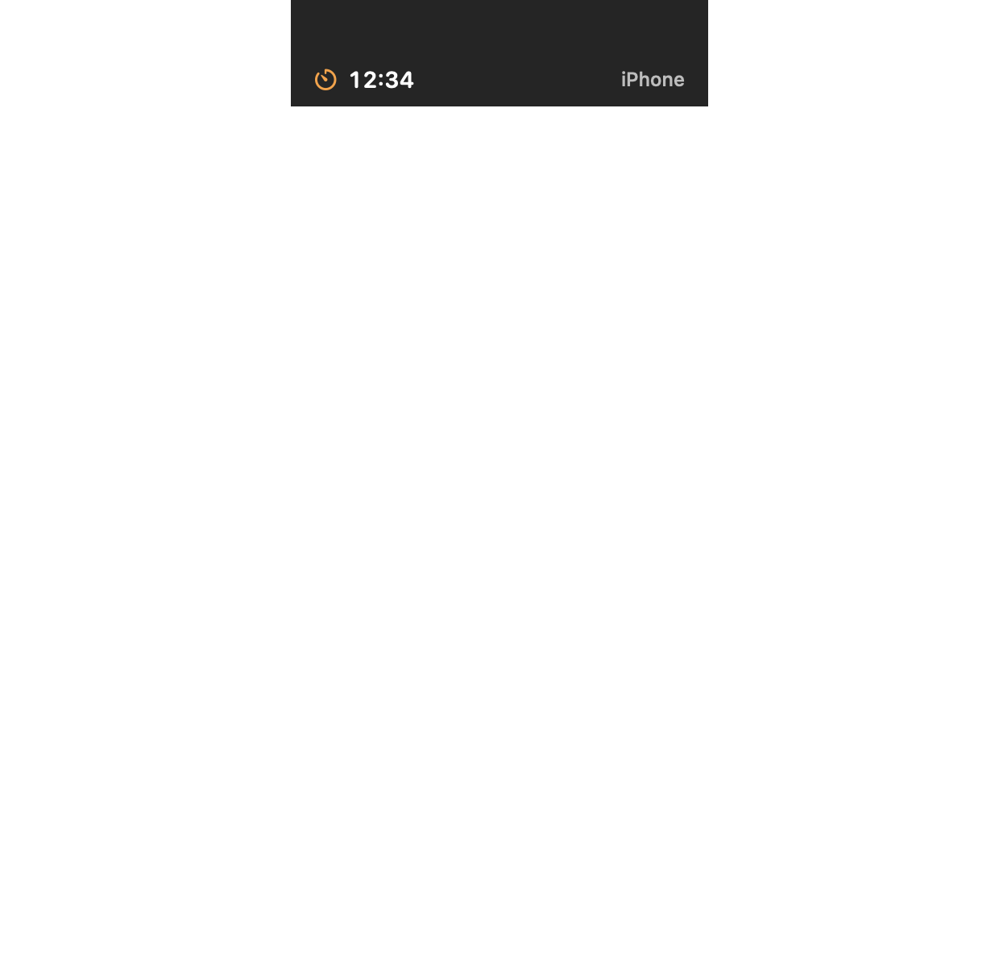

# Say hello to Notcher — the tide line between your Mac and your iPhone.

One live activity in the notch: your timer, your transfers, your music.
Drag files onto the notch to park them. Pair your iPhone over the local
network and flick a timer across. When nothing is alive, the island melts
into the camera housing. No widgets. No cloud. No noise.



[](https://github.com/gonisulaimann/Notcher/releases)
[](https://github.com/gonisulaimann/Notcher/releases)
[](LICENSE)

| Timer pill | iPhone mirror |
|---|---|
|  |  |
| *Your countdown, always in view.* | *Your iPhone's timer, ticking in the notch.* |

| Now Playing | Idle blend |
|---|---|
|  |  |
| *What's playing, one glance.* | *Nothing alive: melted into the housing.* |

## Install

**You need:** macOS 14 or later, and a MacBook with a notch
(no notch? it falls back to a floating capsule).

1. Download **Notcher-0.3.0.dmg** from
   [Releases](https://github.com/gonisulaimann/Notcher/releases).
2. Open the DMG and drag Notcher into Applications.
3. The first-launch warning is EXPECTED — the build is ad-hoc signed, and
   macOS will say it can't verify the app. You only deal with this once.
   Pick whichever method you like:

**Recommended: Terminal (always works)**

```bash
xattr -dr com.apple.quarantine /Applications/Notcher.app
```

Then open the app normally.

**Alternative: right-click → Open → Open**

Right-click (or Control-click) Notcher.app in Finder → Open → Open.
Done — it launches normally from then on.

## Usage

- Hover the notch, and voilà — it blooms open around whatever is alive.
- Drag any file onto the notch, and voilà — it's parked in the Harbor
  shelf until you drag it out or reveal it in Finder.
- Click the waves icon in the menu bar → Start 25-minute Timer, and voilà
  — the notch becomes your countdown.
- Open the tray → iPhone Link, and voilà — a six-digit pairing code for
  your iPhone. Start a timer there and it ticks in both places.
- Quit from the tray footer when you're done, not by killing the process.

## The iPhone companion

Notcher is at its best with your iPhone nearby — mirrored timers, notes
and files flowing both ways over your local Wi-Fi, nothing touching a
server. The companion ships separately (see
[Companion-iOS](Companion-iOS/README-iOS.md)); hardware testing on a real
iPhone is still pending, honestly marked in the engineering history.

## 🗺 Roadmap

- [ ] SPAKE2 pairing 🤝
- [ ] iPhone Live Activity mirror 📲
- [ ] Connection-quality indicator 📶
- [ ] Multi-display islands 🖥️

## Build from source

Requirements: macOS with Swift toolchain (Command Line Tools are enough —
no Xcode needed for the Mac app).

```bash
git clone https://github.com/gonisulaimann/Notcher.git
cd Notcher
swift build                 # everything
./Scripts/build-app.sh      # Notcher.app bundle
./Scripts/release.sh        # reproducible DMG in dist/
swift run LinkSelfTest      # protocol checks
swift run IslandSnapshot    # renders the island states to PNG
```

## Engineering

One line: [`docs/RECORD.md`](docs/RECORD.md) is the full honest
engineering history — every claim, evidence attached.

## Privacy

Local network only. Pairing code never leaves your devices. Text and files
move only when you explicitly send them. No clipboard snooping, no analytics.

## License

MIT — see [LICENSE](LICENSE).
